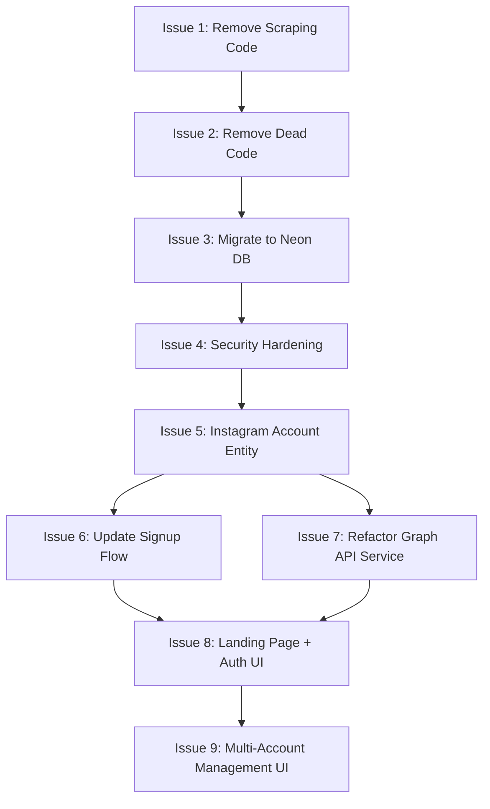

# 🛠️ Implementation Issues — Instagram Post Analytics Dashboard

> **Project**: `Social-media` (Spring Boot 3.2 + React/Vite/Tailwind)  
> **Repo root**: `d:\PROJECTS\Social-media`  
> **Created**: 2026-06-20  
> Each issue is **standalone** — an AI tool can pick any single issue and implement it end-to-end without prior context from the others, though they should be executed in the listed order for minimal merge conflicts.

---

## Table of Contents

| # | Issue | Priority | Estimated Effort |
|---|-------|----------|-----------------|
| 1 | [Remove all web-scraping code and unused dependencies](#issue-1-remove-all-web-scraping-code-and-unused-dependencies) | 🔴 High | Medium |
| 2 | [Remove all remaining unused / dead code](#issue-2-remove-all-remaining-unused--dead-code) | 🟡 Medium | Small |
| 3 | [Migrate database from local PostgreSQL to Neon (serverless Postgres)](#issue-3-migrate-database-from-local-postgresql-to-neon-serverless-postgres) | 🔴 High | Medium |
| 4 | [Add security hardening — rate limiting, DoS prevention, JWT best practices](#issue-4-add-security-hardening--rate-limiting-dos-prevention-jwt-best-practices) | 🔴 High | Large |
| 5 | [Create new `InstagramAccount` entity for per-user multi-account Graph API credentials](#issue-5-create-new-instagramaccount-entity-for-per-user-multi-account-graph-api-credentials) | 🔴 High | Large |
| 6 | [Update signup flow to collect Instagram Graph API credentials during registration](#issue-6-update-signup-flow-to-collect-instagram-graph-api-credentials-during-registration) | 🔴 High | Large |
| 7 | [Refactor backend to fetch Graph API credentials from database per-user instead of application.properties](#issue-7-refactor-backend-to-fetch-graph-api-credentials-from-database-per-user-instead-of-applicationproperties) | 🔴 High | Large |
| 8 | [Build a professional Home / Landing page with Sign Up & Sign In (shadcn/ui + Tailwind)](#issue-8-build-a-professional-home--landing-page-with-sign-up--sign-in-shadcnui--tailwind) | 🔴 High | Large |
| 9 | [Add multi-account management UI — CRUD for Instagram accounts under a single user](#issue-9-add-multi-account-management-ui--crud-for-instagram-accounts-under-a-single-user) | 🟡 Medium | Medium |

---

## Issue 1: Remove all web-scraping code and unused dependencies

### Context
The project originally used Playwright-based web scraping to fetch Instagram post metrics. This approach is now obsolete because Instagram requires login for post metrics, and the project has fully migrated to the **Instagram Graph API**. The scraping code is already disabled (returns errors), but the files, classes, and dependencies still exist.

### Acceptance Criteria
- [ ] Delete the following **backend files** entirely:
  - `backend/src/main/java/com/socialmedia/instagram/service/PlaywrightScrapingService.java` (568 lines — the main scraping implementation)
  - `backend/src/main/java/com/socialmedia/instagram/service/ScrapingService.java` (interface)
  - `backend/src/main/java/com/socialmedia/instagram/service/ScrapingException.java` (exception class)
  - `backend/src/main/java/com/socialmedia/instagram/config/PlaywrightConfig.java` (browser config)
  - `backend/src/main/java/com/socialmedia/instagram/dto/ScrapedPostData.java` (DTO)
- [ ] Delete the following **debug artifacts** from `backend/`:
  - `backend/debug-page.html` (809 KB)
  - `backend/debug-screenshot.png` (589 KB)
  - `backend/request.json`
  - `backend/.jqwik-database`
- [ ] Remove the **Playwright Maven dependency** from `backend/pom.xml`:
  ```xml
  <!-- Lines 116-121 — Playwright for Web Scraping -->
  <dependency>
      <groupId>com.microsoft.playwright</groupId>
      <artifactId>playwright</artifactId>
      <version>1.40.0</version>
  </dependency>
  ```
- [ ] Remove the **scraping configuration** from `backend/src/main/resources/application.properties`:
  ```properties
  # Lines 80-83 — Scraping Configuration
  scraping.retry.max-attempts=3
  scraping.retry.backoff.initial=5000
  scraping.retry.backoff.multiplier=2
  ```
- [ ] Update `DemoController.java` — remove the `ScrapingService` dependency injection and the `/api/demo/scrape` endpoint. Remove the `health()` method's reference to `scrapingService.isRateLimited()`. If the controller becomes empty, delete it entirely.
- [ ] Update `MetricsCollectionService.java` — remove the `ScrapingService` field injection (`private final ScrapingService scrapingService;`), remove the dead `collectViaScraping()` method (line 195-197), and remove the `ScrapedPostData` import.
- [ ] Update `SecurityConfig.java` — remove the `.requestMatchers("/api/demo/**").permitAll()` rule (line 69) since the demo endpoints will be gone.
- [ ] Verify the project still compiles: `cd backend && mvn compile -q`

### Files Affected
| Action | File |
|--------|------|
| DELETE | `backend/src/.../service/PlaywrightScrapingService.java` |
| DELETE | `backend/src/.../service/ScrapingService.java` |
| DELETE | `backend/src/.../service/ScrapingException.java` |
| DELETE | `backend/src/.../config/PlaywrightConfig.java` |
| DELETE | `backend/src/.../dto/ScrapedPostData.java` |
| DELETE | `backend/debug-page.html` |
| DELETE | `backend/debug-screenshot.png` |
| DELETE | `backend/request.json` |
| DELETE | `backend/.jqwik-database` |
| MODIFY | `backend/pom.xml` |
| MODIFY | `backend/src/.../resources/application.properties` |
| MODIFY | `backend/src/.../controller/DemoController.java` (or DELETE) |
| MODIFY | `backend/src/.../service/MetricsCollectionService.java` |
| MODIFY | `backend/src/.../config/SecurityConfig.java` |

---

## Issue 2: Remove all remaining unused / dead code

### Context
After removing the scraping code (Issue 1), there are additional pieces of dead or unused code throughout the project that should be cleaned up.

### Acceptance Criteria
- [ ] Remove the **AWS SDK dependencies** from `pom.xml` if not actively used (S3 and Secrets Manager — lines 137-147). The `ExportService` should be checked — if it only exports locally or returns blobs directly, these AWS deps are dead weight.
  ```xml
  <!-- AWS SDK for S3 -->
  <dependency>
      <groupId>software.amazon.awssdk</groupId>
      <artifactId>s3</artifactId>
      <version>2.21.42</version>
  </dependency>
  <dependency>
      <groupId>software.amazon.awssdk</groupId>
      <artifactId>secretsmanager</artifactId>
      <version>2.21.42</version>
  </dependency>
  ```
- [ ] Remove **unused application.properties** entries if the corresponding features are not implemented:
  ```properties
  # Export Configuration (if not using S3)
  export.s3.bucket-name=instagram-analytics-exports
  export.s3.region=us-east-1
  export.presigned-url.expiration=86400
  ```
- [ ] Audit `DataSeeder.java` — ensure it uses proper idempotent seeding and does not hard-code passwords in production. Add a `@Profile("dev")` annotation so it only runs in development.
- [ ] Remove the hardcoded `admin@example.com` / `password` default login credentials from `Login.tsx` (lines 6-7):
  ```tsx
  const [email, setEmail] = useState('admin@example.com');
  const [password, setPassword] = useState('password');
  ```
  Replace with empty strings:
  ```tsx
  const [email, setEmail] = useState('');
  const [password, setPassword] = useState('');
  ```
- [ ] Remove the placeholder routes in `frontend/src/router/index.tsx`:
  ```tsx
  { path: 'analytics', element: <div>Analytics</div> },
  { path: 'notifications', element: <div>Notifications</div> },
  ```
- [ ] Clean up the `frontend/src/hooks/useWebSocket.ts` — verify it is actively used; if not, remove it.
- [ ] Verify both frontend and backend compile successfully after cleanup.

### Files Affected
| Action | File |
|--------|------|
| MODIFY | `backend/pom.xml` |
| MODIFY | `backend/src/.../resources/application.properties` |
| MODIFY | `backend/src/.../config/DataSeeder.java` |
| MODIFY | `frontend/src/pages/Login.tsx` |
| MODIFY | `frontend/src/router/index.tsx` |
| REVIEW | `frontend/src/hooks/useWebSocket.ts` |
| REVIEW | `backend/src/.../service/ExportService.java` |

---

## Issue 3: Migrate database from local PostgreSQL to Neon (serverless Postgres)

### Context
The project currently uses a local PostgreSQL instance (via Docker Compose) with credentials hardcoded in `application.properties`. The database should be migrated to **Neon** (serverless PostgreSQL) for production readiness.

### Acceptance Criteria
- [ ] Create a **Neon project** (manual step — document the process) or provide a template `.env` file with placeholders.
- [ ] Update `backend/src/main/resources/application.properties` to use **environment variables** for the database connection instead of hardcoded values:
  ```properties
  # Replace:
  spring.datasource.url=jdbc:postgresql://localhost:5432/post
  spring.datasource.username=postgres
  spring.datasource.password=1234

  # With:
  spring.datasource.url=${DATABASE_URL:jdbc:postgresql://localhost:5432/post}
  spring.datasource.username=${DATABASE_USERNAME:postgres}
  spring.datasource.password=${DATABASE_PASSWORD:1234}
  ```
- [ ] Add **Neon-specific connection pooling** configuration. Neon uses connection pooling via PgBouncer; add:
  ```properties
  spring.datasource.hikari.maximum-pool-size=5
  spring.datasource.hikari.minimum-idle=1
  spring.datasource.hikari.connection-timeout=20000
  spring.datasource.hikari.idle-timeout=300000
  ```
- [ ] Add **SSL configuration** for Neon (Neon requires SSL):
  ```properties
  spring.datasource.hikari.data-source-properties.sslmode=require
  ```
- [ ] Create a `.env.example` file in the project root with all required environment variables documented:
  ```env
  # Neon Database
  DATABASE_URL=jdbc:postgresql://<your-neon-host>.neon.tech:5432/<dbname>?sslmode=require
  DATABASE_USERNAME=<neon-username>
  DATABASE_PASSWORD=<neon-password>

  # JWT
  JWT_SECRET=<your-256-bit-secret>

  # Instagram Graph API (per-user credentials stored in DB after Issue 5)
  # These global defaults can be removed after Issue 5-7 are complete
  INSTAGRAM_APP_ID=
  INSTAGRAM_APP_SECRET=
  INSTAGRAM_ACCESS_TOKEN=
  INSTAGRAM_IG_USER_ID=
  ```
- [ ] Update `docker-compose.yml` — keep the local Postgres service for development but add a comment that production uses Neon.
- [ ] Ensure Flyway migrations (V1–V8) are compatible with Neon's PostgreSQL (they should be — Neon is standard Postgres 16).
- [ ] Create an `application-prod.properties` profile with production settings.
- [ ] Verify the application starts and Flyway migrations succeed against both local and Neon databases.

### Files Affected
| Action | File |
|--------|------|
| MODIFY | `backend/src/main/resources/application.properties` |
| NEW | `backend/src/main/resources/application-prod.properties` |
| NEW | `.env.example` |
| MODIFY | `docker-compose.yml` |

---

## Issue 4: Add security hardening — rate limiting, DoS prevention, JWT best practices

### Context
The current application has JWT authentication but lacks rate limiting, DoS prevention, and several security best practices. The `SecurityConfig.java` disables CSRF (acceptable for stateless APIs) but has no rate limiting, no request size limits, and uses a weak default JWT secret.

### Acceptance Criteria

#### 4.1 — Rate Limiting (backend)
- [ ] Add the **Bucket4j** dependency (or Spring Boot's built-in rate limiter) to `pom.xml`:
  ```xml
  <dependency>
      <groupId>com.bucket4j</groupId>
      <artifactId>bucket4j-core</artifactId>
      <version>8.7.0</version>
  </dependency>
  ```
- [ ] Create a `RateLimitFilter.java` in `backend/src/.../config/` or `backend/src/.../security/`:
  - Apply rate limiting per IP address
  - Login endpoint (`/api/auth/login`): **5 requests per minute** (brute-force protection)
  - Registration endpoint (`/api/auth/register`): **3 requests per minute**
  - General API endpoints: **60 requests per minute** per authenticated user
  - Return `HTTP 429 Too Many Requests` with a `Retry-After` header when limit is exceeded
- [ ] Register the filter in `SecurityConfig.java` before the JWT filter.

#### 4.2 — JWT Security Best Practices (backend)
- [ ] Move the JWT secret to an **environment variable** in `application.properties`:
  ```properties
  # Replace:
  jwt.secret=your-secret-key-change-this-in-production-min-256-bits

  # With:
  jwt.secret=${JWT_SECRET:default-dev-secret-change-in-production-must-be-256-bits-long!!}
  ```
- [ ] Ensure `JwtTokenProvider.java` validates:
  - Token signature (already done)
  - Token expiration (already done)
  - Token issuer (`iss` claim — add `instagram-analytics` as issuer)
  - Token audience (`aud` claim — add validation)
- [ ] Reduce access token expiration from **15 minutes** (900000ms) to **10 minutes** for tighter security.
- [ ] Add **token blacklisting** on logout using Redis (the project already has Redis configured):
  - When a user logs out, add their access token's JTI to a Redis blacklist with TTL = remaining expiration time
  - Check the blacklist in `JwtAuthenticationFilter.java` before accepting a token

#### 4.3 — Request Validation & DoS Prevention (backend)
- [ ] Add request body size limits in `application.properties`:
  ```properties
  spring.servlet.multipart.max-file-size=5MB
  spring.servlet.multipart.max-request-size=10MB
  server.tomcat.max-http-form-post-size=5MB
  ```
- [ ] Add input validation annotations to all DTOs that don't have them (the `AuthController` DTOs are good — check `PostController`, `ProfileController`, and `ExportController` DTOs).
- [ ] Add `@Size` constraints to prevent excessively long string inputs.

#### 4.4 — Security Headers (backend)
- [ ] Add security response headers via `SecurityConfig.java`:
  ```java
  .headers(headers -> headers
      .contentTypeOptions(Customizer.withDefaults())
      .xssProtection(Customizer.withDefaults())
      .frameOptions(frame -> frame.deny())
      .httpStrictTransportSecurity(hsts -> hsts
          .includeSubDomains(true)
          .maxAgeInSeconds(31536000))
  )
  ```

#### 4.5 — CORS Hardening (backend)
- [ ] Move CORS allowed origins to environment variables:
  ```properties
  cors.allowed-origins=${CORS_ORIGINS:http://localhost:5173,http://localhost:3000}
  ```
- [ ] Read `cors.allowed-origins` from `@Value` instead of hardcoding in `SecurityConfig.java`.

### Files Affected
| Action | File |
|--------|------|
| MODIFY | `backend/pom.xml` |
| NEW | `backend/src/.../security/RateLimitFilter.java` |
| MODIFY | `backend/src/.../config/SecurityConfig.java` |
| MODIFY | `backend/src/.../security/JwtTokenProvider.java` |
| MODIFY | `backend/src/.../security/JwtAuthenticationFilter.java` |
| MODIFY | `backend/src/main/resources/application.properties` |

---

## Issue 5: Create new `InstagramAccount` entity for per-user multi-account Graph API credentials

### Context
Currently, Instagram Graph API credentials (`app-id`, `app-secret`, `access-token`, `ig-user-id`) are stored in `application.properties` as **global singletons**. This means:
1. Only one set of credentials works for the entire application.
2. Every user is forced to use the same Instagram account.

The requirement is: **each registered user can add multiple Instagram accounts**, each with its own set of Graph API credentials. These credentials must be stored **encrypted** in the database.

### Acceptance Criteria
- [ ] Create a new entity `InstagramAccount.java` in `backend/src/.../entity/`:
  ```java
  @Entity
  @Table(name = "instagram_accounts")
  public class InstagramAccount {
      @Id
      @GeneratedValue(strategy = GenerationType.AUTO)
      private UUID id;

      @ManyToOne(fetch = FetchType.LAZY)
      @JoinColumn(name = "user_id", nullable = false)
      private User user;

      @Column(name = "account_name", nullable = false)
      private String accountName; // Friendly display name, e.g. "My Business Account"

      @Column(name = "ig_user_id", nullable = false)
      private String igUserId; // instagram.graph-api.ig-user-id

      @Column(name = "app_id", nullable = false)
      private String appId; // instagram.graph-api.app-id

      @Column(name = "app_secret", nullable = false)
      private String appSecret; // instagram.graph-api.app-secret (encrypted)

      @Column(name = "access_token", nullable = false, length = 1000)
      private String accessToken; // instagram.graph-api.access-token (encrypted)

      @Column(name = "is_active", nullable = false)
      private Boolean isActive = true;

      @Column(name = "token_expires_at")
      private Instant tokenExpiresAt;

      @CreationTimestamp
      private Instant createdAt;

      @UpdateTimestamp
      private Instant updatedAt;
  }
  ```
- [ ] Create a Flyway migration `V9__create_instagram_accounts_table.sql`:
  ```sql
  CREATE TABLE instagram_accounts (
      id UUID PRIMARY KEY DEFAULT gen_random_uuid(),
      user_id UUID NOT NULL,
      account_name VARCHAR(255) NOT NULL,
      ig_user_id VARCHAR(255) NOT NULL,
      app_id VARCHAR(255) NOT NULL,
      app_secret TEXT NOT NULL,
      access_token TEXT NOT NULL,
      is_active BOOLEAN NOT NULL DEFAULT true,
      token_expires_at TIMESTAMP WITH TIME ZONE,
      created_at TIMESTAMP WITH TIME ZONE NOT NULL DEFAULT CURRENT_TIMESTAMP,
      updated_at TIMESTAMP WITH TIME ZONE NOT NULL DEFAULT CURRENT_TIMESTAMP,
      CONSTRAINT fk_instagram_accounts_user FOREIGN KEY (user_id) REFERENCES users(id) ON DELETE CASCADE
  );

  CREATE INDEX idx_instagram_accounts_user_id ON instagram_accounts(user_id);
  ```
- [ ] Create `InstagramAccountRepository.java`:
  ```java
  public interface InstagramAccountRepository extends JpaRepository<InstagramAccount, UUID> {
      List<InstagramAccount> findByUserId(UUID userId);
      List<InstagramAccount> findByUserIdAndIsActiveTrue(UUID userId);
      Optional<InstagramAccount> findByIdAndUserId(UUID id, UUID userId);
      boolean existsByUserIdAndIgUserId(UUID userId, String igUserId);
  }
  ```
- [ ] Create `InstagramAccountService.java` with CRUD operations:
  - `createAccount(UUID userId, CreateAccountDTO dto)` — validates credentials via Graph API token validation, encrypts `appSecret` and `accessToken` before storing
  - `getAccountsByUser(UUID userId)` — returns all accounts for a user (with secrets masked in response)
  - `getAccountById(UUID accountId, UUID userId)` — returns single account (with secrets decrypted for internal use)
  - `updateAccount(UUID accountId, UUID userId, UpdateAccountDTO dto)`
  - `deleteAccount(UUID accountId, UUID userId)`
  - `getDecryptedCredentials(UUID accountId)` — internal method for backend use
- [ ] Create `InstagramAccountController.java` with REST endpoints:
  - `POST /api/accounts` — Create a new Instagram account
  - `GET /api/accounts` — List all accounts for the authenticated user
  - `GET /api/accounts/{id}` — Get single account details
  - `PUT /api/accounts/{id}` — Update account credentials
  - `DELETE /api/accounts/{id}` — Delete an account
- [ ] Create a `CredentialEncryptionService.java` utility to encrypt/decrypt sensitive fields using AES-256-GCM:
  - Encryption key stored as env var: `CREDENTIAL_ENCRYPTION_KEY`
  - Add to `.env.example`
- [ ] Add validation: prevent duplicate `ig_user_id` per user.
- [ ] Add proper DTOs: `CreateInstagramAccountRequest`, `UpdateInstagramAccountRequest`, `InstagramAccountResponse` (masks `appSecret` and `accessToken` in response).
- [ ] Ensure the endpoints are protected — users can only access their own accounts.

### Files Affected
| Action | File |
|--------|------|
| NEW | `backend/src/.../entity/InstagramAccount.java` |
| NEW | `backend/src/.../repository/InstagramAccountRepository.java` |
| NEW | `backend/src/.../service/InstagramAccountService.java` |
| NEW | `backend/src/.../service/CredentialEncryptionService.java` |
| NEW | `backend/src/.../controller/InstagramAccountController.java` |
| NEW | `backend/src/main/resources/db/migration/V9__create_instagram_accounts_table.sql` |
| MODIFY | `.env.example` |

---

## Issue 6: Update signup flow to collect Instagram Graph API credentials during registration

### Context
Currently, the signup flow only collects `email`, `password`, `fullName`, and `role`. After Issue 5 creates the `InstagramAccount` entity, the signup process should **optionally** allow users to enter their first Instagram account credentials during registration. This makes onboarding seamless — the user can immediately start fetching analytics after signing up.

### Acceptance Criteria

#### 6.1 — Backend Changes
- [ ] Update `AuthController.RegisterRequest` to accept optional Instagram credentials:
  ```java
  public record RegisterRequest(
      @NotBlank @Email String email,
      @NotBlank @Size(min = 8) String password,
      @NotBlank String fullName,
      String role, // default to VIEWER if not provided
      // Optional: first Instagram account credentials
      String igUserId,
      String appId,
      String appSecret,
      String accessToken,
      String accountName
  ) {}
  ```
- [ ] Update `AuthService.register()` to:
  1. Create the user (existing logic)
  2. If Instagram credentials are provided, create an `InstagramAccount` via `InstagramAccountService.createAccount()`
  3. Return the auth response with an additional `instagramAccountId` field if an account was created
- [ ] Default the `role` to `VIEWER` if not explicitly provided (most users won't know about roles).

#### 6.2 — Frontend Changes
- [ ] Update `frontend/src/api/apiClient.ts` to add a `register()` function:
  ```typescript
  export const register = async (data: {
    email: string;
    password: string;
    fullName: string;
    igUserId?: string;
    appId?: string;
    appSecret?: string;
    accessToken?: string;
    accountName?: string;
  }) => { /* POST /api/auth/register */ };
  ```
- [ ] The signup form UI is handled in Issue 8, but the API client must be ready.

### Files Affected
| Action | File |
|--------|------|
| MODIFY | `backend/src/.../controller/AuthController.java` |
| MODIFY | `backend/src/.../service/AuthService.java` |
| MODIFY | `frontend/src/api/apiClient.ts` |

---

## Issue 7: Refactor backend to fetch Graph API credentials from database per-user instead of `application.properties`

### Context
Currently, `InstagramGraphApiService.java` reads Graph API credentials from `@Value` properties (global `application.properties`). After Issue 5 creates the `InstagramAccount` entity, the service must be refactored to **fetch credentials from the database per-user/per-account** rather than using global config.

### Acceptance Criteria
- [ ] Modify `InstagramGraphApiService.java`:
  - Remove the `@Value` fields for `appId`, `appSecret`, `accessToken`, `igUserId` (lines 44-62)
  - Modify `fetchPostInsights()` to accept an `InstagramAccount` (or its decrypted credentials) instead of a raw `accessToken` string
  - Modify `fetchProfileInfo()` to accept user-specific credentials instead of the global ones
  - Modify `getMediaIdFromShortcode()` to use per-account credentials
  - Modify `validateToken()` to use per-account `appId`/`appSecret`
  - Modify `refreshAccessToken()` to use per-account `appId`/`appSecret`, and update the `InstagramAccount` record with the new token
  - Modify `getDefaultAccessToken()` — this should now take a `UUID userId` or `UUID accountId` and look up credentials from the database
- [ ] Update `MetricsCollectionService.java` to:
  - Look up the `InstagramAccount` associated with a post's profile and user
  - Pass the decrypted credentials to `InstagramGraphApiService` methods
- [ ] Update `PostController.java` `fetchMetricsByUrl()` endpoint:
  - Accept an optional `accountId` (UUID) parameter that specifies which Instagram account's credentials to use
  - If no `accountId` is provided, use the authenticated user's first active account
- [ ] Update `ProfileController.java` similarly.
- [ ] Remove the **global Instagram credentials** from `application.properties`:
  ```properties
  # REMOVE these lines:
  instagram.graph-api.app-id=...
  instagram.graph-api.app-secret=...
  instagram.graph-api.access-token=...
  instagram.graph-api.ig-user-id=...
  ```
- [ ] Keep `graph-api.base-url` and `graph-api.retry.max-attempts` as global config (these are not per-user).
- [ ] Update `InstagramProfile` entity to add an optional `@ManyToOne` reference to `InstagramAccount` (the account whose credentials are used to fetch this profile's data).

### Files Affected
| Action | File |
|--------|------|
| MODIFY | `backend/src/.../service/InstagramGraphApiService.java` |
| MODIFY | `backend/src/.../service/GraphApiService.java` (interface) |
| MODIFY | `backend/src/.../service/MetricsCollectionService.java` |
| MODIFY | `backend/src/.../controller/PostController.java` |
| MODIFY | `backend/src/.../controller/ProfileController.java` |
| MODIFY | `backend/src/.../entity/InstagramProfile.java` |
| MODIFY | `backend/src/main/resources/application.properties` |

---

## Issue 8: Build a professional Home / Landing page with Sign Up & Sign In (shadcn/ui + Tailwind)

### Context
The current frontend has a minimal `Login.tsx` page and no proper home/landing page. There is no signup page at all. The app needs a professional, modern landing page with both Sign Up and Sign In options, built with **shadcn/ui** and **Tailwind CSS** (already installed: Tailwind v4.3).

### Acceptance Criteria

#### 8.1 — Install shadcn/ui
- [ ] Install shadcn/ui in the frontend:
  ```bash
  cd frontend
  npx shadcn@latest init
  ```
  - Choose: TypeScript, Default style, CSS variables for colors
- [ ] Install required shadcn components:
  ```bash
  npx shadcn@latest add button card input label tabs form toast dialog separator badge
  ```

#### 8.2 — Home / Landing Page (`/`)
- [ ] Create `frontend/src/pages/Home.tsx` — a beautiful, modern landing page with:
  - **Hero section**: Gradient background, bold headline ("Instagram Analytics Dashboard"), subtitle describing the product, and two prominent CTAs: "Get Started" (→ signup) and "Sign In" (→ login)
  - **Features section**: 3-4 feature cards with icons highlighting key features (Real-time Analytics, Multi-Account Support, Graph API Integration, Export Reports)
  - **Footer**: Minimal footer with copyright
  - Use glassmorphism, gradients, and micro-animations (hover effects, entrance animations)
  - Dark mode friendly (optional but ideal)
  - Fully responsive (mobile, tablet, desktop)

#### 8.3 — Sign Up Page (`/signup`)
- [ ] Create `frontend/src/pages/Signup.tsx` — a multi-step or single-page registration form:
  - **Step 1 — Account Info**: Email, Password, Confirm Password, Full Name
  - **Step 2 — Instagram Credentials (optional, can skip)**: Account Name, IG User ID, App ID, App Secret, Access Token
  - Each field should have helper text explaining where to find the value (link to Facebook Developer Console)
  - Form validation: email format, password strength (min 8 chars), matching passwords
  - "Already have an account? Sign In" link
  - On success: redirect to dashboard
  - Use shadcn/ui `Card`, `Input`, `Label`, `Button`, `Form` components

#### 8.4 — Revamp Sign In Page (`/login`)
- [ ] Redesign `frontend/src/pages/Login.tsx` using shadcn/ui components:
  - Match the design language of the new Home and Signup pages
  - Email + Password fields
  - "Don't have an account? Sign Up" link
  - Error handling with toast notifications
  - Use shadcn/ui `Card`, `Input`, `Label`, `Button` components

#### 8.5 — Routing Updates
- [ ] Update `frontend/src/router/index.tsx`:
  ```tsx
  // New routes:
  { path: '/', element: <Home /> }        // Landing page (public)
  { path: '/login', element: <Login /> }   // Sign in (public)
  { path: '/signup', element: <Signup /> } // Sign up (public)
  // Authenticated routes under App layout:
  { path: '/app', element: <App />, children: [
      { index: true, element: <Navigate to="/app/dashboard" /> },
      { path: 'dashboard', element: <SpreadsheetDashboard /> },
      { path: 'profiles', element: <Profiles /> },
      { path: 'posts', element: <Posts /> },
      { path: 'accounts', element: <AccountsPage /> }, // Issue 9
  ]}
  ```
- [ ] Add route guards: redirect unauthenticated users from `/app/*` to `/login`.
- [ ] Add reverse guards: redirect authenticated users from `/`, `/login`, `/signup` to `/app/dashboard`.

#### 8.6 — Design System
- [ ] Use a cohesive color palette — **purple/indigo gradient** theme (consistent with existing gradient usage in the app)
- [ ] Use **Inter** or **Geist** font from Google Fonts
- [ ] All interactive elements must have hover effects and transitions
- [ ] Forms should have loading states on submit buttons

### Files Affected
| Action | File |
|--------|------|
| NEW | `frontend/src/pages/Home.tsx` |
| NEW | `frontend/src/pages/Signup.tsx` |
| MODIFY | `frontend/src/pages/Login.tsx` |
| MODIFY | `frontend/src/router/index.tsx` |
| MODIFY | `frontend/src/App.tsx` |
| MODIFY | `frontend/src/index.css` |
| MODIFY | `frontend/src/api/apiClient.ts` |
| NEW | `frontend/src/components/ui/*` (shadcn components) |
| NEW | `frontend/src/lib/utils.ts` (shadcn utility) |
| MODIFY | `frontend/tailwind.config.js` |
| MODIFY | `frontend/index.html` (add font) |

---

## Issue 9: Add multi-account management UI — CRUD for Instagram accounts under a single user

### Context
After Issue 5 creates the backend `InstagramAccount` entity and API, the frontend needs a dedicated page for users to manage their Instagram accounts (add, view, edit, delete).

### Acceptance Criteria
- [ ] Create `frontend/src/pages/AccountsPage.tsx`:
  - **Header**: "Instagram Accounts" with an "Add Account" button
  - **Account list**: Display all Instagram accounts as cards with:
    - Account name
    - IG User ID (visible)
    - App ID (visible)
    - App Secret (masked, with "show" toggle)
    - Access Token (masked, with "show" toggle)
    - Status badge: Active/Inactive
    - Token expiration date (if available)
    - Actions: Edit, Delete
  - **Add Account modal/dialog** (shadcn `Dialog`):
    - Fields: Account Name, IG User ID, App ID, App Secret, Access Token
    - "Test Credentials" button — calls the backend to validate the token before saving
    - Save button
  - **Edit Account modal**: Pre-populated with existing values, secrets shown masked
  - **Delete confirmation dialog**: "Are you sure you want to delete this account?"
- [ ] Update `frontend/src/api/apiClient.ts` with account management API functions:
  ```typescript
  export const getAccounts = async (token: string) => { /* GET /api/accounts */ };
  export const createAccount = async (data: CreateAccountData, token: string) => { /* POST /api/accounts */ };
  export const updateAccount = async (id: string, data: UpdateAccountData, token: string) => { /* PUT /api/accounts/{id} */ };
  export const deleteAccount = async (id: string, token: string) => { /* DELETE /api/accounts/{id} */ };
  export const testCredentials = async (data: TestCredentialsData, token: string) => { /* POST /api/accounts/test */ };
  ```
- [ ] Add the "Accounts" nav link to `App.tsx` navigation bar.
- [ ] Add the route in `router/index.tsx` (within the authenticated layout).
- [ ] When selecting an Instagram account for analytics operations (fetching posts, profiles), add an account selector dropdown in the Posts and Profiles pages.

### Files Affected
| Action | File |
|--------|------|
| NEW | `frontend/src/pages/AccountsPage.tsx` |
| MODIFY | `frontend/src/api/apiClient.ts` |
| MODIFY | `frontend/src/App.tsx` |
| MODIFY | `frontend/src/router/index.tsx` |
| MODIFY | `frontend/src/pages/Posts.tsx` |
| MODIFY | `frontend/src/pages/Profiles.tsx` |

---

## Execution Order (Recommended)



> **Note**: Issues 1-4 are foundational cleanup/hardening. Issues 5-7 are the core credential architecture. Issues 8-9 are the frontend experience. This order minimizes merge conflicts and ensures each issue builds on a clean foundation.
